# EcoLambda

Aplicación móvil para Android desarrollada con **Kotlin**, **Jetpack Compose**, **Firebase** y **TensorFlow Lite**, diseñada para clasificar residuos mediante Inteligencia Artificial y fomentar el reciclaje mediante información educativa.

---

# Características

- Inicio de sesión y registro de usuarios.
- Clasificación de residuos utilizando un modelo de Inteligencia Artificial.
- Captura de fotografías desde la cámara.
- Selección de imágenes desde la galería.
- Historial de clasificaciones realizadas.
- Recomendaciones automáticas para el reciclaje.
- Información educativa sobre separación de residuos.
- Integración con Firebase Authentication.
- Integración con Firebase Realtime Database.
- Modelo TensorFlow Lite entrenado con un dataset personalizado.

---

# Tecnologías utilizadas

- Kotlin
- Jetpack Compose
- Firebase Authentication
- Firebase Realtime Database
- TensorFlow Lite
- Python
- Android Studio

---

# Mi participación

Durante el desarrollo del proyecto participé en distintas etapas, entre ellas:

- Desarrollo de interfaces de usuario.
- Implementación de funcionalidades de la aplicación.
- Desarrollo del proceso de clasificación mediante IA.
- Preparación y organización del dataset.
- Entrenamiento del modelo utilizando TensorFlow.
- Integración del modelo TensorFlow Lite dentro de la aplicación.
- Integración con Firebase Authentication y Realtime Database.
- Pruebas y validación del funcionamiento general.

---

# Capturas de pantalla

## Autenticación

| Inicio de sesión | Crear cuenta |
|-----------------|--------------|
| 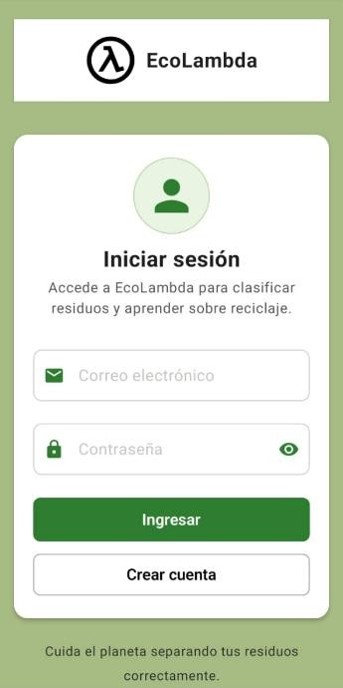 | 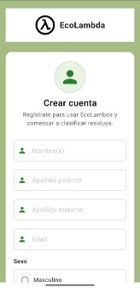 |

---

## Aplicación

### Menú principal

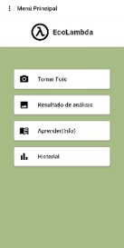

---

### Clasificar residuo

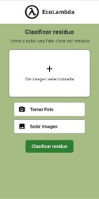

---

### Resultado del análisis

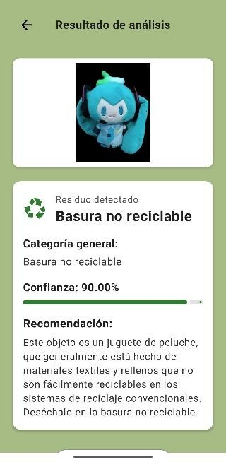

---

### Historial

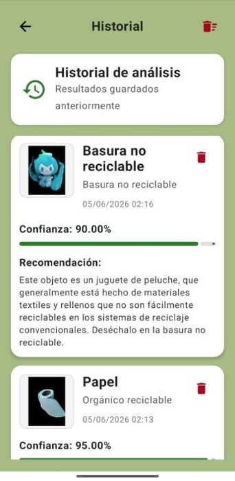

---

### Aprende a reciclar

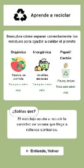

---

### Información de residuos

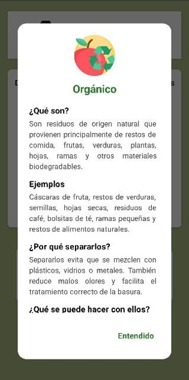

---

### Perfil del usuario

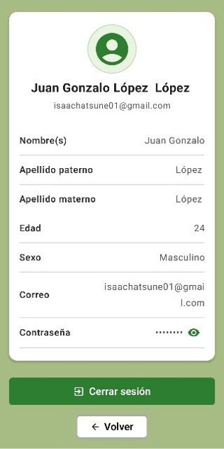

---

# Inteligencia Artificial

## Código de entrenamiento

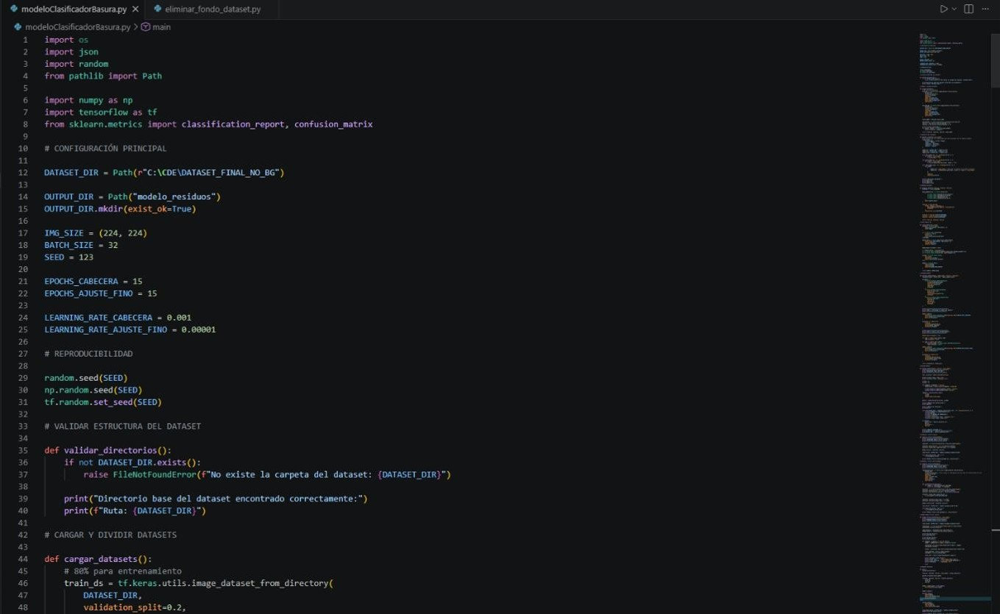

---

## Script para eliminar fondo

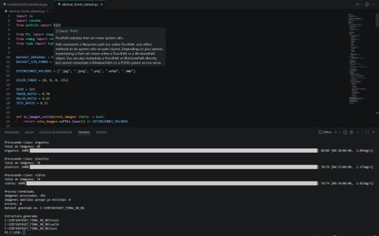

---

## Estructura del dataset

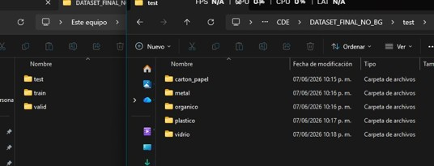

---

## Imágenes del dataset

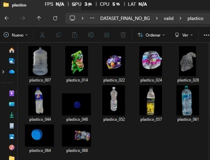

---

## Modelo TensorFlow Lite

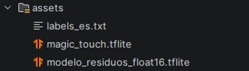

---

# Desarrollo

## Android Studio

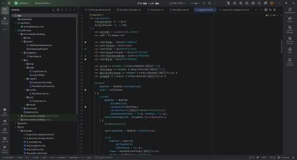

---

# Firebase

## Authentication

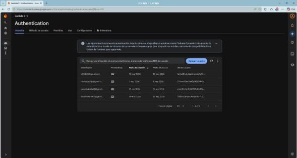

---

## Realtime Database

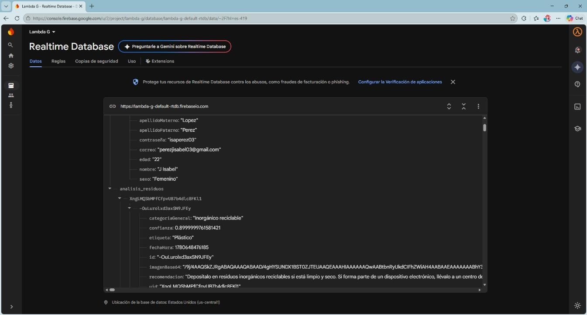

---

# Estructura del proyecto

```
EcoLambda/
│
├── app/
├── gradle/
├── Screenshots/
├── modeloClasificadorBasura.py
├── eliminar_fondo_dataset.py
├── build.gradle.kts
└── README.md
```

---

# Autor

**Juana Isabel Perez Lopez**

Proyecto desarrollado como parte de la carrera de Ingeniería en Sistemas Computacionales.
